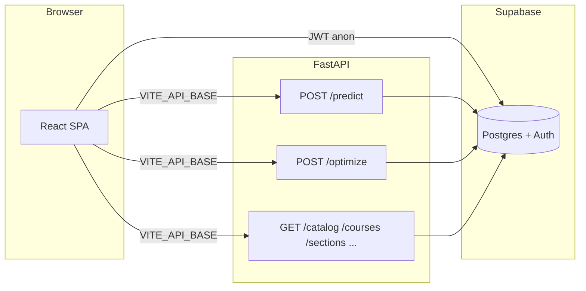

# ACE — project context (single reference)

This file is the **onboarding + agent brief** for the whole repository: what ACE is, how the pieces connect, where things live, and which docs to read next. It does not replace specialized files like [`MODEL_CARD.md`](MODEL_CARD.md) or [`REPRO.md`](REPRO.md); it points to them.

---

## 1. What this product is

**ACE** is a **UCSB schedule and planning** experience built around:

1. A **grade predictor** (XGBoost) trained on years of historical grade distributions, joined with catalog and professor features.
2. An **integer-program schedule optimizer** (PuLP + CBC) that returns **feasible, non-conflicting** schedules under unit and time constraints, with explainable per-section scores.
3. A **React dashboard** (auth, transcript parsing, explorer, schedule builder, graduation path) backed by **Supabase** (profiles, RLS) and a **FastAPI** service (ML + catalog + optimization).

**Positioning (one line):** aggregate section-level predictions plus combinatorial scheduling, not a personal GPA guarantee — see disclaimers in the app and in [`README.md`](README.md).

---

## 2. Tech stack (at a glance)

| Layer | Technology |
|--------|------------|
| Frontend | React 19, Vite 6, TypeScript, React Router 7, Motion, CSS variables (no heavy UI kit) |
| Backend | FastAPI, Pydantic v2, Supabase Python client, PuLP (CBC), XGBoost artifacts loaded from disk |
| Data | Daily Nexus–style grade history, UCSB curriculum API, RateMyProfessor (scraped, cached), Claude-assisted major-sheet extraction (pipeline only) |
| Database | Supabase (Postgres + Auth + RLS) |
| Hosting pattern | Static SPA (e.g. Vercel) + API elsewhere (e.g. Fly); **not** a single full-stack server |

---

## 3. Repository layout (high level)

```
ace/
├── frontend/                 SPA: pages, design tokens in index.css, majors bundle, PDF parser
├── backend/                  FastAPI app + ML artifacts under app/ml/artifacts/
├── data_pipeline/           Numbered scripts: ingest → features → train → plots
├── backend/supabase/        SQL migrations / reference DDL (run in Supabase SQL editor)
├── scripts/                 Smoke tests, judge runbook
├── docs/                    Decision-system notes, pitch poster source, agent spec
├── Makefile                 ds-train, ds-conformal, ds-plots, ds-decision-eval
├── vercel.json              Root-directory deploy: frontend build from monorepo root
├── frontend/vercel.json     Alternative when Vercel “Root Directory” = frontend
├── README.md                Product overview, metrics snapshot, links
├── MODEL_CARD.md            Model behavior, metrics, limitations
├── REPRO.md                 Artifact hashes, make targets for ML refresh
├── DECISION_EVAL.md         Optimizer objective / risk toy evaluation
└── PROJECT_CONTEXT.md       This file
```

---

## 4. Runtime architecture



- **Browser → Supabase:** auth and row-level secure reads/writes on `student_profiles` (and related) using the **anon key** and user JWT.
- **Browser → FastAPI:** all ML and heavy catalog/section queries use **`VITE_API_BASE`** (must be the deployed API origin in production).
- **FastAPI → Supabase:** **service role** key server-side only (never in the SPA). Used for sections, grades, professors, optimization logging, etc.

---

## 5. Frontend (what to know)

| Path | File | Role |
|------|------|------|
| `/` | `pages/Landing.tsx` | Marketing + demo entry |
| `/auth` | `pages/Auth.tsx` | Supabase auth |
| `/onboarding` | `pages/Onboarding.tsx` | PDF upload, major selection |
| `/dashboard` | `pages/Dashboard.tsx` | Summary, progress |
| `/explorer` | `pages/Explorer.tsx` | Catalog / sections exploration |
| `/schedule` | `pages/Schedule.tsx` | Optimizer UI (modal results, calendar-style views) |
| `/grad-path` | `pages/GradPath.tsx` | Major graph / planning |
| `/settings` | `pages/Settings.tsx` | Profile, transcript, demo toggle |
| `/status` | `pages/Status.tsx` | API / model health |
| `/showcase-lab` | `pages/ShowcaseLab.tsx` | Internal / demo metrics UI |

**Important modules**

- `src/lib/api.ts` — all REST calls; **`VITE_API_BASE`** defaults to `http://localhost:8000`.
- `src/lib/supabase.ts` — **`VITE_SUPABASE_URL`**, **`VITE_SUPABASE_ANON_KEY`** required for real auth.
- `src/lib/pdf-parser.ts` — UCSB Academic History PDF parsing (pdfjs).
- `src/data/majors.ts` — **bundled** major requirement graphs for GradPath / Schedule (demo works offline). Must stay broadly in sync with pipeline output when majors change.
- `src/lib/student-bundle.ts` / `course-norm.ts` — normalization helpers for courses and profile bundles.

**Build:** `cd frontend && npm run build` → `frontend/dist/`.

---

## 6. Backend (what to know)

**Entry:** `backend/app/main.py` — registers routers, CORS from **`ACE_CORS_ORIGINS`** (comma-separated).

**Config:** `backend/app/config.py` — loads `.env` from `backend/` or repo root; critical vars:

| Variable | Purpose |
|----------|---------|
| `SUPABASE_URL` | Supabase project URL |
| `SUPABASE_SERVICE_ROLE_KEY` | Server-only; full DB access for API |
| `ACE_CORS_ORIGINS` | Allowed browser origins (include production SPA URL) |
| `UCSB_API_KEY` | Optional; live catalog crawl for `/catalog/*` |
| `ACE_MODEL_DIR` | Override path to ML artifacts (default `app/ml/artifacts`) |

**Routers** (see [`backend/README.md`](backend/README.md) for the full table): `health`, `catalog`, `courses`, `sections`, `professors`, `majors`, `ge`, `trends`, `predict`, `optimize`, `schedules`.

**ML**

- `app/ml/predictor.py` — loads `xgb_model.json`, `xgb_feature_cols.json`, optional `conformal_quantiles.json`; returns μ, intervals, regime, etc.
- `app/ml/optimizer.py` — PuLP MILP; preferences include **`risk_lambda`**, **`diversity_lambda`**, optional **`elective_subject_bonus`** / **`preferred_elective_prefixes`** for elective emphasis.
- `app/ml/artifacts/` — model JSON, feature list, conformal quantiles, `model_meta.json` (predictor id for `/health`).

**Run locally:** `uvicorn app.main:app --reload --port 8000` from `backend/` with venv and `pip install -e ".[dev]"`.

---

## 7. Supabase (schema intent)

SQL files under `backend/supabase/` are meant to be applied in order in the Supabase SQL editor (see comments in each file):

| File | Purpose |
|------|---------|
| `001_student_profiles.sql` | User profile, RLS policies |
| `002_data_tables.sql` | Course/grade/section–adjacent application tables |
| `003_demo_mode.sql` | Demo flags / helpers |
| `004_student_ingestion_events.sql` | Audit / ingestion telemetry |
| `005_optimization_runs.sql` | Optional logging of `/optimize` requests (with `user_id` when sent) |
| `006_optimizer_preferences.sql` | Optimizer preference blob on profile |
| `007_saved_schedules.sql` | Saved schedule candidates per user |
| `008_optimization_runs_evidence.sql` | Bundle digest column on `optimization_runs` |

Exact columns evolve — read the SQL as source of truth.

---

## 8. Data pipeline (mental model)

**Goal:** reproducible path from raw inputs → `processed/unified.csv` → features → trained model → artifacts copied into `backend/app/ml/artifacts/`.

**Script families** (see [`data_pipeline/README.md`](data_pipeline/README.md)):

- **01–04:** Nexus grades, UCSB catalog, RMP, merge → `processed/unified.csv`
- **05–08:** Major sheets → review → Supabase load → `majors.ts`
- **10–14:** Features, baselines, XGBoost train, cold-start report
- **15:** Embeddings (optional / local)
- **16:** Synthetic students JSON for demo mode
- **20–25:** Pitch / showcase plots, regime reliability, decision eval, showcase improvement charts, competition metric CSV export
- **21:** Conformal calibration → quantiles consumed by predictor

**Makefile shortcuts** (repo root): `make ds-train`, `make ds-conformal`, `make ds-plots`, `make ds-decision-eval`, `make ds-artifacts`.

---

## 9. Environment variables (cheat sheet)

**Repo root `.env`** (often shared): backend and pipeline read Supabase and API keys; **never commit** (`.gitignore`).

**Frontend** (local or Vercel):

| Var | Required for |
|-----|----------------|
| `VITE_SUPABASE_URL` | Auth + profile |
| `VITE_SUPABASE_ANON_KEY` | Auth + profile |
| `VITE_API_BASE` | FastAPI origin (production URL in deploy) |

**Backend** (Fly / Docker / local):

| Var | Required |
|-----|----------|
| `SUPABASE_URL` | Yes |
| `SUPABASE_SERVICE_ROLE_KEY` | Yes |
| `ACE_CORS_ORIGINS` | Must list your deployed SPA origin |

---

## 10. Deployment notes

**Frontend (Vercel)**

- Root [`vercel.json`](vercel.json): installs with **`NPM_CONFIG_PRODUCTION=false`** so **devDependencies** (Vite, TypeScript) install on CI; build outputs `frontend/dist`.
- If the Vercel project **Root Directory** is set to `frontend`, prefer [`frontend/vercel.json`](frontend/vercel.json) and commands **without** `--prefix frontend`.
- SPA routing: catch-all rewrite to `index.html`.

**Backend**

- Not deployed by Vercel in this setup; typically a container or process manager with env vars above.
- CORS must allow the production SPA origin.

---

## 11. Demo mode and synthetic students

- Landing / settings can steer users into **demo** flows without a real transcript.
- Synthetic student definitions live under `frontend/public/` (see `frontend/README.md`).
- Profile helpers in `src/lib/profile.ts` apply synthetic bundles when demo is active.

---

## 12. CI and quality gates

- [`.github/workflows/ci.yml`](.github/workflows/ci.yml): Python (ruff, mypy, pytest), Docker smoke where applicable, frontend **tsc + vite build**.
- Frontend: `npm run test` runs Vitest (see `frontend/vitest.config.ts`).

---

## 13. Naming and conventions

- **`course_norm`:** canonical course code string used across API, DB, and frontend (normalization in `toCourseNorm` / `course-norm.ts`).
- **Quarter codes:** e.g. `20262` = 2026 Winter (UCSB-style `YYYYQ`).
- **Majors:** `major_id` strings (e.g. `econ_ba`) must match keys in `frontend/src/data/majors.ts` for bundled UX.

---

## 14. Further reading (deep dives)

| Topic | Doc |
|-------|-----|
| Product pitch + metrics summary | [`README.md`](README.md) |
| Model metrics, calibration, limitations | [`MODEL_CARD.md`](MODEL_CARD.md) |
| Reproducibility, hashes, `make ds-*` | [`REPRO.md`](REPRO.md) |
| Optimizer risk / decision framing | [`DECISION_EVAL.md`](DECISION_EVAL.md) |
| Decision system narrative | [`docs/ACE_decision_system_note.md`](docs/ACE_decision_system_note.md) |
| Pipeline commands and data grain | [`data_pipeline/README.md`](data_pipeline/README.md) |
| Judge / hackathon run order | [`scripts/JUDGE_RUNBOOK.md`](scripts/JUDGE_RUNBOOK.md) |
| Backend API surface | [`backend/README.md`](backend/README.md) |
| Frontend routes and PDF parser | [`frontend/README.md`](frontend/README.md) |

---

## 15. What this file is not

- Not a legal or university-compliance document.
- Not a substitute for reading SQL migrations when changing schema.
- Not guaranteed exhaustive on every script flag; use `--help` and the numbered scripts’ headers.

When in doubt, search the repo for the endpoint or env var name, then update **this file** if you discover a stable invariant worth remembering.
