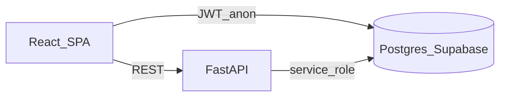

# ACE — full context for agents (single-file brief)

Use this document when an AI agent needs **end-to-end** understanding of how the product **actually** works: architecture, data flow, honest capabilities, and **what not to claim**. It synthesizes the repo’s canonical references and `docs/` extras.

**Canonical repo entrypoints (read order for humans):**

1. [`PROJECT_CONTEXT.md`](../PROJECT_CONTEXT.md) — layout, env vars, routers, deployment pattern  
2. [`README.md`](../README.md) — product overview  
3. [`MODEL_CARD.md`](../MODEL_CARD.md) — predictor behavior, metrics, limitations  
4. [`REPRO.md`](../REPRO.md) — artifact regeneration  
5. [`DECISION_EVAL.md`](../DECISION_EVAL.md) — synthetic optimizer risk toy  

---

## 1. One-sentence product

**ACE** is a **UCSB-focused** web app that combines **historical grade–aware section prediction** (XGBoost + conformal-style intervals), **combinatorial schedule optimization** (PuLP / CBC), and **student profile evidence** (transcript parsing, Supabase), exposed through a **React SPA** and **FastAPI** API.

It does **not** replace GOLD or official advising; it aggregates **public / imported** academic data for exploration and planning.

---

## 2. Tech stack (production shape)

| Layer | Stack |
|-------|--------|
| Frontend | React 19, Vite 6, TypeScript, React Router 7, Motion, CSS variables |
| Backend | FastAPI, Pydantic v2, Supabase Python client (service role server-side) |
| ML | XGBoost regressor (artifacts on disk), PuLP + CBC MILP |
| DB | Supabase = Postgres + Auth + RLS |
| Data pipeline | Python scripts under `data_pipeline/scripts/` → `processed/` |

**Hosting pattern:** static SPA (e.g. Vercel) + API elsewhere (e.g. Fly) — **not** one monolithic server rendering HTML.

---

## 3. Runtime architecture (who talks to whom)

- **Browser ↔ Supabase:** anon key + user JWT — **auth**, `student_profiles`, RLS-protected rows (saved schedules, etc. where migrated).
- **Browser ↔ FastAPI:** `VITE_API_BASE` — **all ML**, heavy catalog/section/grade queries (`/predict`, `/optimize`, `/catalog`, …).
- **FastAPI ↔ Supabase:** **service role** key **only on server** — reads/writes sections, `grade_distributions`, professors, optimization logging, etc.

---

## 4. Frontend routes (mental map)

| Route | Purpose |
|-------|---------|
| `/` | Landing / marketing |
| `/auth` | Supabase auth |
| `/onboarding` | PDF transcript, majors |
| `/dashboard` | Summary |
| `/explorer` | Courses, sections, trends |
| `/schedule` | Pool + **Optimize** (SSE pipeline overlay + fallback sync) + results modal + saved schedules |
| `/grad-path` | Major requirement graph |
| `/settings` | Profile, prefs, demo |
| `/status` | API health |

Key client modules: `frontend/src/lib/api.ts` (REST), `frontend/src/lib/supabase.ts`, `frontend/src/lib/pdf-parser.ts`, bundled majors in `frontend/src/data/majors.ts`.

---

## 5. Backend (FastAPI)

**Entry:** `backend/app/main.py` — CORS from `ACE_CORS_ORIGINS`.

**Important routers:** `health`, `catalog`, `courses`, `sections`, `professors`, `majors`, `ge`, `trends`, `predict`, `optimize`, `schedules` (see `backend/README.md` table).

**ML:**

- `backend/app/ml/predictor.py` — loads `xgb_model.json`, feature cols, optional conformal quantiles; **`_build_feature_rows`** joins `sections`, `courses`, `professors`, `grade_distributions`.
- `backend/app/ml/optimizer.py` — MILP; consumes section candidates + preference weights; **risk_lambda** shrinks effective grade score using interval width.

**Optimize router** (`backend/app/routers/optimize.py`): normalizes course codes, loads sections for pool, batch-predicts, runs MILP, enriches with historical aggregates + RMP; with **`user_id`**, merges **`student_profiles.completed_courses`** with client payload, logs **grounding** and **`student_evidence_bundle_sha256`** on `optimization_runs` (requires migration `008_optimization_runs_evidence.sql`). **`POST /optimize/stream`** exposes the same pipeline as **SSE** (`text/event-stream`) with JSON `data:` frames per phase and a final `complete` event carrying the full **`OptimizeResponse`** — used by the Schedule page for a truthful activity log (see `backend/README.md`).

---

## 6. “Knowledge graph” / SKP — honest wording

**Marketing name:** *Student Knowledge Plane (SKP)* — see [`STUDENT_KNOWLEDGE_PLANE_INTERNAL_BRIEF.md`](STUDENT_KNOWLEDGE_PLANE_INTERNAL_BRIEF.md).

**Implementation truth:** **Postgres tables + stable IDs + joins** — not Neo4j. See [`DEPLOYED_KNOWLEDGE_GRAPH.md`](DEPLOYED_KNOWLEDGE_GRAPH.md).

**“Agents”** in internal docs = **named pipeline stages** (predict, optimize, ingest checks) implemented as **Python + SQL**, **not** an LLM planner or multi-agent swarm.

---

## 7. Data pipeline & ML artifacts

- Raw → `data_pipeline/processed/unified.csv` → features → **`13_xgboost.py`** → `processed/xgb_model.json` etc. → copy into **`backend/app/ml/artifacts/`**.
- Makefile shortcuts from repo root: `make ds-train`, `make ds-conformal`, `make ds-plots`, `make ds-decision-eval`, `make ds-artifacts`.
- Pitch figures: `data_pipeline/processed/pitch/*.svg`, `metrics_table.json`.
- Competition metrics doc: [`COMPETITION_METRICS.md`](COMPETITION_METRICS.md).

---

## 8. Supabase migrations (run in order in SQL editor)

Reference files under `backend/supabase/`: `001` student profiles → `002` data tables → … → **`008`** evidence bundle column on `optimization_runs`. Exact columns evolve — **SQL files are source of truth**.

---

## 9. Metrics agents can cite (with sources)

| Claim | Source |
|-------|--------|
| Holdout RMSE **0.234** full XGBoost vs **0.293** without historical aggregates | `MODEL_CARD.md` |
| ~**25%** RMSE degradation without history features | Same test slice |
| Synthetic risk toy: **risk_lambda** lowers MILP objective when intervals wide | `DECISION_EVAL.md`, `decision_eval_synthetic.json` |
| G1/G2 grounding rates | `25_competition_metrics_export.py` → `processed/competition/g1_g2_summary.csv` (needs live runs + migration **008**) |

---

## 10. What agents must NOT claim

- **Individual grade prediction** — model targets **section mean GPA** aggregates, not “your grade.”
- **“LLM agents query the knowledge graph”** — core path has **no** LLM orchestration.
- **Universal accuracy gains from “KG”** without pointing to the **defined ablation** (historical-feature removal) or another **measured** baseline.
- **Official articulation or degree audit** — pool is user-built; major graphs are **bundled hints** plus server data, not registrar truth.

See [`LIMITATIONS_COMPETITION.md`](LIMITATIONS_COMPETITION.md).

---

## 11. Optional future: NL layer (not shipped as described)

[`ACE_agent_tools_spec.md`](ACE_agent_tools_spec.md) sketches **tool-calling** over the same APIs — **Phase sketch**, not current runtime.

---

## 12. Which `docs/` files to attach for “full context”

**Minimum bundle (fast):**

- This file: **`docs/AGENT_FULL_CONTEXT.md`**
- [`PROJECT_CONTEXT.md`](../PROJECT_CONTEXT.md)

**Strong bundle (pitch + architecture):**

- Above **plus** [`STUDENT_KNOWLEDGE_PLANE_INTERNAL_BRIEF.md`](STUDENT_KNOWLEDGE_PLANE_INTERNAL_BRIEF.md)
- [`DEPLOYED_KNOWLEDGE_GRAPH.md`](DEPLOYED_KNOWLEDGE_GRAPH.md)
- [`COMPETITION_METRICS.md`](COMPETITION_METRICS.md)

**ML / judging rigor:**

- [`../MODEL_CARD.md`](../MODEL_CARD.md)
- [`../DECISION_EVAL.md`](../DECISION_EVAL.md)

**Honesty / Q&A:**

- [`LIMITATIONS_COMPETITION.md`](LIMITATIONS_COMPETITION.md)

**Optional workflow study:**

- [`WORKFLOW_BENCHMARK_PROTOCOL.md`](WORKFLOW_BENCHMARK_PROTOCOL.md)

---

*Last aligned with repo layout and optimizer grounding behavior as of the competition-metrics implementation; re-read `PROJECT_CONTEXT.md` after large refactors.*
