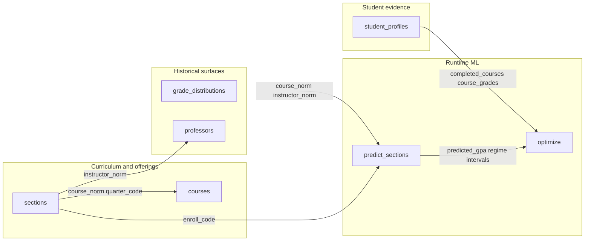

# Deployed knowledge graph (ACE / Postgres)

ACE does **not** use a separate graph database. The **Student Knowledge Plane** is implemented as **typed entities** (tables), **stable IDs** (`course_norm`, `enroll_code`, `quarter_code`, `user_id`), and **SQL joins** — the same shapes the grade predictor and MILP use.

## Join keys (mental model)

| Edge | Keys |
|------|------|
| Section → course | `sections.course_norm` ↔ `courses.course_norm` |
| Section → quarter | `sections.quarter_code` |
| Grade history → section grain | `grade_distributions.(course_norm, instructor_norm, quarter, …)` |
| Professor signals | `sections.instructor_norm` ↔ `professors.instructor_norm` |
| Student → optimizer | `student_profiles.user_id` → merged `completed_courses` for feasibility |

## Read paths

- **Prediction:** [`backend/app/ml/predictor.py`](../backend/app/ml/predictor.py) — `_build_feature_rows` joins `sections`, `courses`, `professors`, `grade_distributions`.
- **Optimization:** [`backend/app/routers/optimize.py`](../backend/app/routers/optimize.py) — loads sections for pool courses, calls `predict_sections`, MILP, then enriches from `grade_distributions` + `professors`.

Canonical narrative doc: [`STUDENT_KNOWLEDGE_PLANE_INTERNAL_BRIEF.md`](STUDENT_KNOWLEDGE_PLANE_INTERNAL_BRIEF.md).
